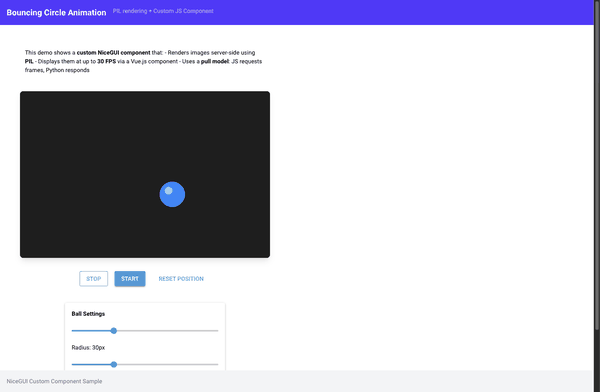

# 🎯 Nice Prompt

> **Teach AI agents to build beautiful NiceGUI applications**

[](https://www.python.org/downloads/)
[](https://nicegui.io/)
[](LICENSE)

<p align="center">
  
</p>

A comprehensive toolkit of prompts, patterns, and examples that help AI coding assistants generate correct, idiomatic [NiceGUI](https://nicegui.io/) code.

## ✨ Features

- **📚 Complete Documentation** - Events, mechanics, styling, and class references
- **🔐 Authentication Patterns** - Signed cookie persistence, role-based permissions, login flows
- **🧭 SPA Navigation** - `ui.sub_pages`, header/drawer visibility, back button handling
- **🧪 Working Samples** - Full multi-dashboard app, stock analysis, custom components
- **🤖 AI-Optimized** - Single master prompt (~22K tokens) for context injection
- **✅ Validated** - All class references and URLs verified
- **🧩 Modular** - Pick what you need or use the full prompt

## 🚀 Quick Start

### Use Pre-Built Prompts (Recommended)

Just download and use the pre-built master prompt directly:

| Variant | Tokens | Use Case | Download |
|---------|--------|----------|----------|
| **Compact** | ~13K | Quick tasks, simple UI | [nice_prompt_compact.md](output/nice_prompt_compact.md) |
| **Optimum** | ~22K | Most use cases | [nice_prompt.md](output/nice_prompt.md) |
| **Extended** | ~27K | Custom components, deployment | [nice_prompt_extended.md](output/nice_prompt_extended.md) |

Copy the content into your AI assistant's context or system prompt.

### Build From Source (Optional)

Only needed if you want to customize or extend the documentation:

```bash
git clone https://github.com/Alyxion/nice-prompt.git
cd nice-prompt
poetry install
poetry run python scripts/build_master_prompt.py
```

## 📋 Requirements

For building from source:
- Python 3.12+
- Poetry

## 📖 Documentation

| Folder | Description |
|--------|-------------|
| [docs/](docs/) | Main documentation |
| [docs/events/](docs/events/) | Event handling patterns |
| [docs/mechanics/](docs/mechanics/) | Core patterns (SPA, authentication, styling) |
| [docs/classes/](docs/classes/) | UI element reference by category |

## 📂 Other Folders

| Folder | Description |
|--------|-------------|
| [samples/](samples/) | Working example applications |
| [output/](output/) | Generated master prompts |
| [scripts/](scripts/) | Build and validation tools |
| [tests/](tests/) | Example NiceGUI tests |

## 🧪 Testing

```bash
poetry run pytest -v
```

## 🤖 Prompt Variants

Each variant is available in **online** (GitHub URLs) and **offline** (local paths) versions:

| Content | Compact | Optimum | Extended |
|---------|:-------:|:-------:|:--------:|
| Main guide | ✓ | ✓ | ✓ |
| Core mechanics | ✓ | ✓ | ✓ |
| Events | ref | ✓ | ✓ |
| Class reference | ref | ✓ | ✓ |
| Custom components | ref | ref | ✓ |
| Configuration & deployment | ref | ref | ✓ |
| Sample references | ✓ | ✓ | ✓ |

**ref** = Not included but referenced with summary (AI knows where to look)

Configure file order and summaries in `docs/prompt_config.yaml`.

## ✅ Validation

```bash
# Validate class references
poetry run python scripts/validate_classes.py

# Also check URLs
poetry run python scripts/validate_classes.py --check-urls
```

## 🙏 Credits

Created by [Michael Ikemann](https://github.com/Alyxion).

Built for use with [NiceGUI](https://nicegui.io/) - a Python UI framework by [Zauberzeug](https://github.com/zauberzeug/nicegui).

## 📄 License

This project is licensed under the MIT License - see the [LICENSE](LICENSE) file for details.

Free to use, modify, and distribute.
